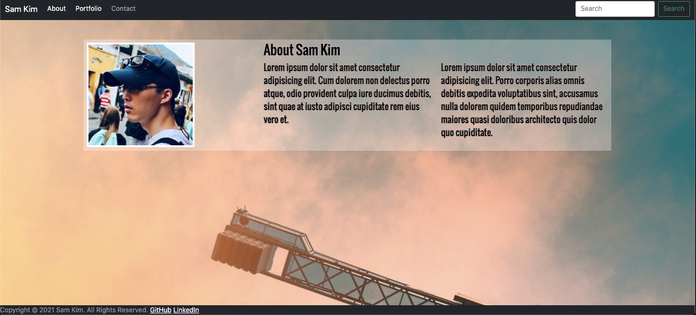
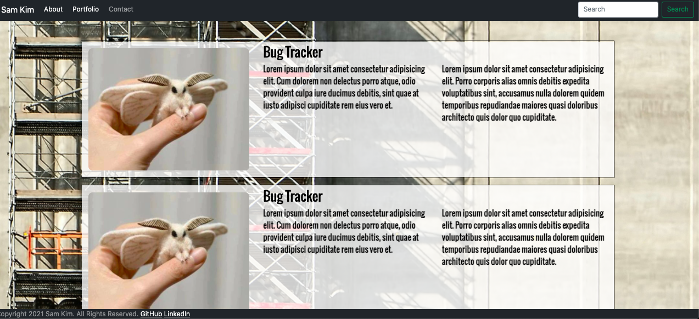
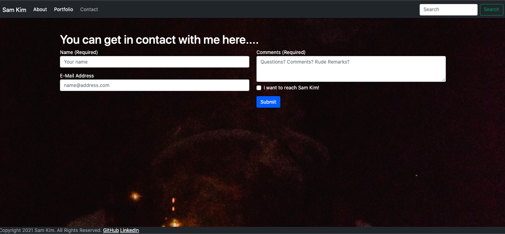

# Homework2 (Due Week 2)

**Deployed application URL**
https://talkingskunk.github.io/portfolio

**GitHub Repository URL**
https://github.com/TalkingSkunk/portfolio

## Table of Contents

* [Description](#description)
* [Installation](#installation)
* [Usage](#usage)
* [Credits](#credits)
* [License](#license)
* [Badges](#badges)
* [Features](#features)
* [Contributing](#contributing)
* [Tests](#tests)

## Description 

**What was the problem?**
- I needed to create a responsive portfolio page.

**What would be the foreseeable consequences of the problem?**
- I need to use Bootstrap, and Font from fonts.google.com

**What were your goals?**
- Make HTML accessible.
- Make the deployed pages responsive.
- Fix any pre-existent bug.

**What have you done about it?**
- I used Bootstrap, and Font from fonts.google.com.
- I made the webpages responsive, and accessible.

## Installation

All you need is a working computer or a smartphone, and access to Internet!

## Usage 

There is no instruction for use and there is no example for use.

## Credits

@Luca B

**Third Party Asset Attributions**
https://utoronto.bootcampcontent.com/utoronto-bootcamp/utor-tor-fsf-ft-01-2021-u-c

**Tutorials**
https://www.w3schools.com/

## License

MIT License

Copyright (c) [2021] [Sam Kim]

Permission is hereby granted, free of charge, to any person obtaining a copy
of this software and associated documentation files (the "Software"), to deal
in the Software without restriction, including without limitation the rights
to use, copy, modify, merge, publish, distribute, sublicense, and/or sell
copies of the Software, and to permit persons to whom the Software is
furnished to do so, subject to the following conditions:

The above copyright notice and this permission notice shall be included in all
copies or substantial portions of the Software.

THE SOFTWARE IS PROVIDED "AS IS", WITHOUT WARRANTY OF ANY KIND, EXPRESS OR
IMPLIED, INCLUDING BUT NOT LIMITED TO THE WARRANTIES OF MERCHANTABILITY,
FITNESS FOR A PARTICULAR PURPOSE AND NONINFRINGEMENT. IN NO EVENT SHALL THE
AUTHORS OR COPYRIGHT HOLDERS BE LIABLE FOR ANY CLAIM, DAMAGES OR OTHER
LIABILITY, WHETHER IN AN ACTION OF CONTRACT, TORT OR OTHERWISE, ARISING FROM,
OUT OF OR IN CONNECTION WITH THE SOFTWARE OR THE USE OR OTHER DEALINGS IN THE
SOFTWARE.

## Badges

## Features

**Pages**
- About Me
- Portfolio
- Contact

## Contributing

[Contributor Covenant](https://www.contributor-covenant.org/version/2/0/code_of_conduct/code_of_conduct.md)

## Tests

No tests required for our application. No examples provided to run tests.

&copy; 2021 Sam Kim
